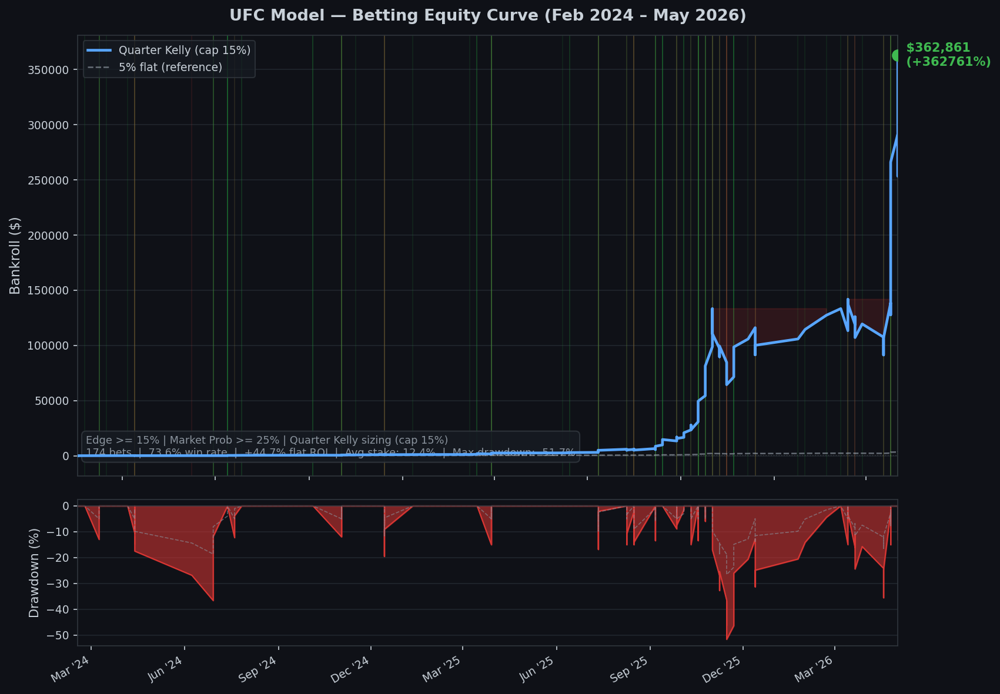

## **UFC Fight Outcome Prediction & Betting System**

A systematic approach to predicting UFC fight outcomes and identifying edge against closing moneylines. A gradient-boosted classifier is trained on 30 years of UFC fight data with strict temporal validation — no data leakage at any stage. The betting strategy filters for model edge against no-vig market prices, validated on a 976-fight out-of-sample holdout.

---

### **Data Foundation**

Built on a purpose-built SQLite database covering **every UFC event from UFC 1 (1994) through present**. All data is scraped, cleaned, and stored locally.

| Dataset | Rows | Source |
|---|---|---|
| Events | 773 | ufcstats.com |
| Fights (with full per-fight stats) | 8,688 | ufcstats.com |
| Fighter profiles | 4,491 | ufcstats.com |
| ML feature vectors | 6,506 | Computed (features.py) |
| Closing moneyline odds | 3,019 fights | bestfightodds.com (2012–present) |
| Per-fight stats collected | 40+ columns | Strikes, TDs, control time, sub attempts, KDs |

Per-fight stats include full strike breakdowns by **target** (head, body, leg) and **position** (distance, clinch, ground), scheduled rounds, and fighter career stats (SLpM, Str Acc, SApM, TD Avg, Sub Avg, DOB).

---

### **The Model**

**Pick accuracy: 74.7% | AUC: 0.834 | Log loss: 0.503**
*(976-fight out-of-sample holdout, Feb 2024 – May 2026)*

**Architecture:** `SimpleImputer → StandardScaler → GradientBoostingClassifier`, wrapped in `CalibratedClassifierCV` (Platt scaling) for calibrated probabilities.

**Training protocol — strict 3-way temporal split, zero leakage:**

```
|──────────── 70% train ────────────|── 15% calibrate ──|── 15% holdout ──|
  Walk-forward CV + grid search        Platt scaling        Never touched
  (54 combos × 7 temporal folds)       only                 until backtest
```

- Walk-forward CV runs on the training portion only — no random splits
- Calibration set is separate from the holdout (GBM probabilities are overconfident without this)
- Holdout is never seen during training, grid search, or calibration

**Feature engineering (110 features, no leakage):**

For each fight, features are built using only fights that occurred *before* that fight. Rolling 7-fight windows (tested 3/5/7/10 — 7 wins on AUC) capture recent form without lookahead. All stats are differenced (f1 − f2) to encode relative advantage and make the model symmetric.

| Feature group | Features |
|---|---|
| Rolling averages | Sig strikes, TDs, control time, KDs, sub attempts (landed + attempted) |
| Derived rates | Strike accuracy, TD accuracy, win rate, finish rate |
| Strike breakdown | Head/body/leg accuracy; distance/clinch/ground distribution |
| Elo ratings | Per-weight-class, granular K-factors (tuned), inactivity decay, pre-fight snapshot |
| Physical | Height/reach differential, stance one-hot encoded |
| Context | Layoff (days since last fight), fighter age at fight time, 5-round experience |
| Market | Closing no-vig implied probability (bestfightodds.com, sportsbooks only) |

**Elo system (elo.py):** Per-weight-class ratings computed chronologically with granular K-factors tuned via grid search — KO/TKO/Sub: K=32, U-DEC/M-DEC: K=30, S-DEC: K=28. Inactivity decay toward 1500 after 365+ days (1%/year). Pre-fight snapshot written into features before ratings update (no leakage).

**Top features by importance:**

| Rank | Feature | Importance |
|---|---|---|
| 1 | diff_elo | 22.0% |
| 2 | diff_fights_count | 16.0% |
| 3 | diff_win_rate | 8.0% |
| 4 | f2_elo_peak | 7.1% |
| 5 | f1_elo_peak | 3.5% |

**Holdout accuracy by confidence bucket:**

| Confidence | Fights | Accuracy |
|---|---|---|
| 50–60% | 187 | 51.3% |
| 60–70% | 199 | 65.3% |
| 70–80% | 203 | 76.4% |
| 80–90% | 223 | 86.1% |
| 90%+ | 164 | 95.1% |

---

### **Betting Strategy & Backtest Results**

**Edge filter:** Bet when `model_prob − no_vig_market_prob ≥ 15%` and market probability of the bet side ≥ 25% (cuts extreme longshots where the model is systematically overconfident).



**Backtest: Feb 2024 – May 2026 (out-of-sample holdout only)**

| Metric | Value |
|---|---|
| Starting bankroll | $100 |
| Terminal bankroll | **$362,861** |
| Total return (Quarter Kelly, compounded) | **+362,761%** |
| Flat ROI per bet | **+44.7%** |
| Win rate | 73.6% (128/174 bets) |
| Max drawdown | -51.7% |
| Avg Kelly stake | 12.4% of bankroll (cap: 15%) |
| Bets placed | 174 (of 329 fights with odds coverage) |
| Avg edge taken | 28.1% |
| Avg decimal odds | 2.10x |
| Holdout period | 976 fights, Feb 2024 – May 2026 |

**Sizing:** Quarter Kelly — `f* = (b·p − q) / b × 0.25`, capped at 15% per bet. Payouts use actual closing moneylines (with book vig). Edge is calculated against no-vig implied probabilities. The model consistently identifies the correct side at 73.6% — well above the ~50% market-implied probability on the same fights.

**Results by market probability bucket:**

| Market prob (bet side) | Bets | Win rate | ROI |
|---|---|---|---|
| 25–30% (extreme dogs) | 0 | — | — |
| 30–40% | 49 | 61.2% | +67.1% |
| 40–50% | 29 | 58.6% | +18.4% |
| 50–60% | 57 | 77.2% | +40.5% |
| 60%+ (favorites) | 84 | 89.3% | +37.9% |

---

### **Technical Architecture**

```
ufcstats.com                      bestfightodds.com
     |                                   |
     v                                   v
scraper.py               odds_scraper.py
(10 threads, rate-limited)   (BFS slug discovery, ~256 events)
     |                                   |
     +-------------------+---------------+
                         |
                    data/ufc.db  (SQLite WAL)
                         |
              +----------+----------+
              |                     |
         features.py            elo.py
    (rolling 7-fight avgs,   (per-weight-class,
     110 features, no leak)   tuned K-factors)
              |                     |
              +----------+----------+
                         |
                     model.py
          (GBM + walk-forward CV + Platt scaling)
                         |
              models/ufc_model_YYYYMMDD.pkl
```

All data stored in a single SQLite database (`data/ufc.db`). No intermediate CSVs. Incremental by default — each module only processes new events on subsequent runs.

---

### **Stack**

Python 3.13 · SQLite WAL · scikit-learn · pandas · numpy · requests · BeautifulSoup · difflib (fuzzy name matching) · matplotlib

---

### **Running It**

```bash
pip install -r requirements.txt

# First run: full historical backfill (UFC 1 -> present, ~20-25 min)
python scraper.py --full
python features.py
python elo.py
python odds_scraper.py
python model.py

# Incremental update (run after each UFC event)
python scraper.py
python features.py
python elo.py
python odds_scraper.py
python model.py

# Evaluate
python backtest.py                              # holdout accuracy, AUC, log loss
python bet_backtest.py                          # betting sim (15% edge, mkt >= 25%)
python bet_backtest.py --threshold 0.10         # override edge threshold
python bet_backtest.py --min-market-prob 0.30   # stricter market filter

# Predict an upcoming fight
python -c "from model import predict_fight; import json; print(json.dumps(predict_fight('Islam Makhachev', 'Charles Oliveira'), indent=2))"
```

---

### **Predict a Fight**

```python
from model import predict_fight

result = predict_fight("Islam Makhachev", "Charles Oliveira", closing_odds_f1=0.71)
# {
#   "fighter_1": "Islam Makhachev",
#   "fighter_2": "Charles Oliveira",
#   "fighter_1_win_prob": 0.673,
#   "fighter_2_win_prob": 0.327,
#   "predicted_winner": "Islam Makhachev",
#   "confidence": 0.673,
#   "elo": {"Islam Makhachev": {"current": 1820.1, "peak": 1831.4}, ...},
#   "market_consensus": {"Islam Makhachev": 0.71, "Charles Oliveira": 0.29},
#   "f1_profile": {"record": {...}, "striking": {...}, "grappling": {...}, ...},
#   "f2_profile": {...}
# }
```

Fighter names must match ufcstats.com exactly (check the `fighters` table in `data/ufc.db` if unsure).

---

### **Status**

| Component | Status |
|---|---|
| Data pipeline (UFC 1 – present, 8,688 fights) | Complete |
| Feature engineering (110 features, no leakage) | Complete |
| Per-weight-class Elo with tuned K-factors | Complete |
| Closing odds scraper (BFO, sportsbooks only) | Complete |
| GBM + walk-forward CV + Platt calibration | Complete |
| Holdout backtest (976 fights, Feb 2024+) | Complete — 74.7% accuracy, AUC 0.834 |
| Betting backtest (174 bets, +44.7% ROI) | Complete — equity curve generated |
| Live prediction interface | Complete — `predict_fight()` |
| Style matchup encoding (wrestler vs striker) | Planned |
| Weight class-specific models | Planned |
